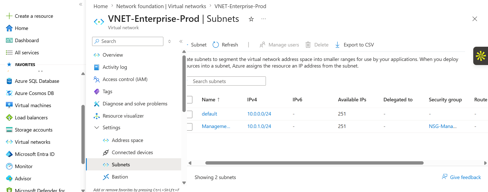
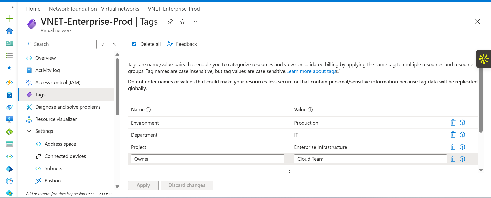
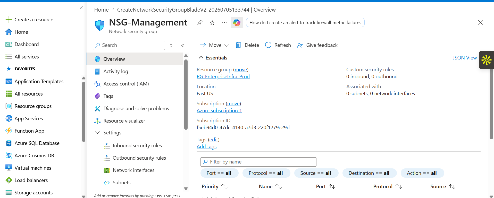
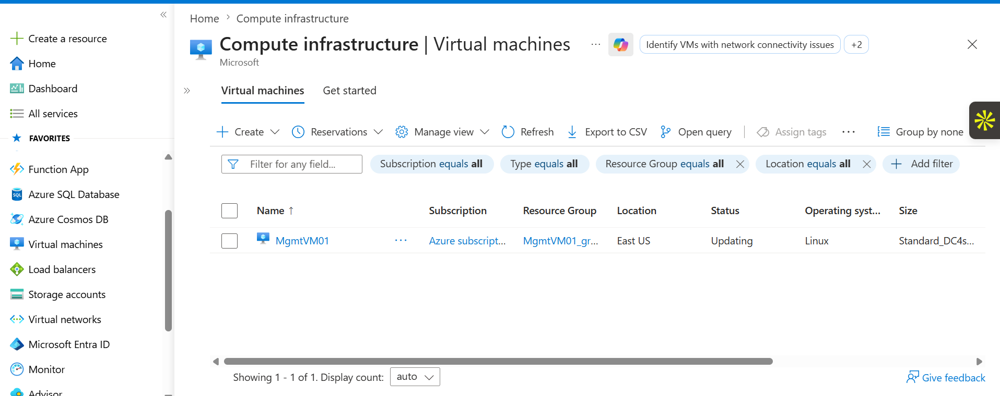
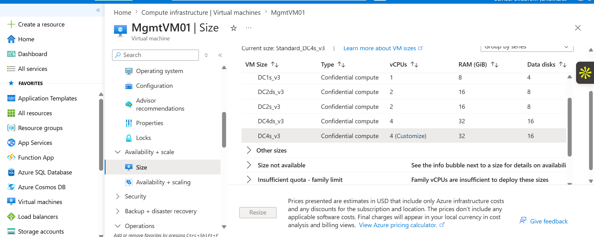
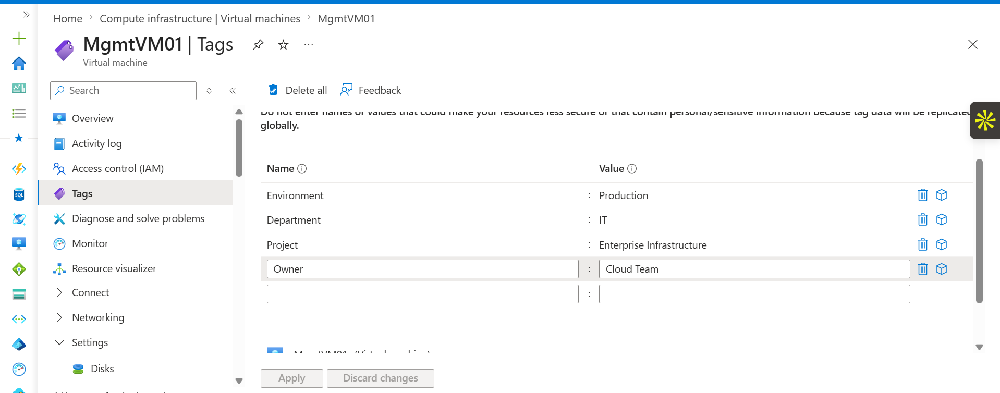
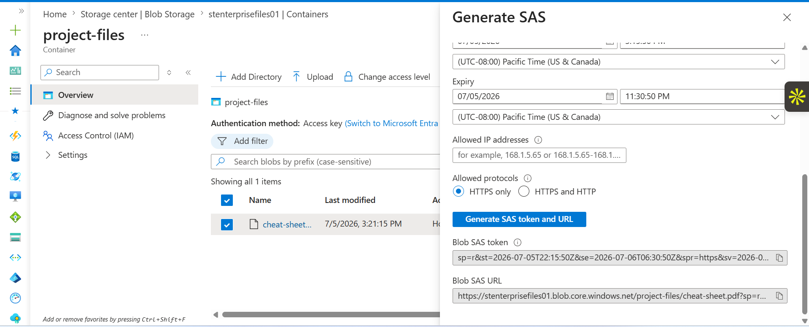

# Azure Networking and Storage Lab

## Overview
This project demonstrates hands-on implementation of Microsoft Azure core services including networking, virtual machines, storage, and security management. It simulates a real-world cloud infrastructure environment where compute, networking, and storage resources are deployed and managed together.

## Project Objectives
- Create and manage Azure Virtual Networks and subnets
- Configure Network Security Groups (NSG) and security rules
- Deploy and manage Virtual Machines
- Perform VM scaling, tagging, and governance
- Work with Azure Storage services such as containers, file shares, and disks
- Manage access keys and SAS tokens
- Apply cost and security best practices

## Networking

### IP Configuration

### Subnets

### VNet Tags

### Additional VNet Tags
.png)

## Network Security (NSG)

### NSG Management

### NSG Alternative Configuration

### Inbound Rules

## Virtual Machines

### VM Overview

### VM Details

### VM Resize

### VM Tags

### VM Lock

## Storage Services

### Containers

### File Share

### Disks

### Access Keys

### SAS Tokens

## Governance and Cost Management

### Resource Groups

### Auto Shutdown

## Skills Demonstrated
- Azure Virtual Networking (VNets, Subnets, IP configuration)
- Network Security Groups (NSG)
- Virtual Machine lifecycle management
- Azure Storage services
- Shared Access Signatures (SAS)
- Access key management
- Resource tagging and governance
- Cost optimization through auto shutdown and VM resizing

## Summary
This project demonstrates practical experience in designing and managing Azure cloud infrastructure. It covers core services including networking, compute, storage, and security, reflecting real-world cloud engineering and DevOps practices.

