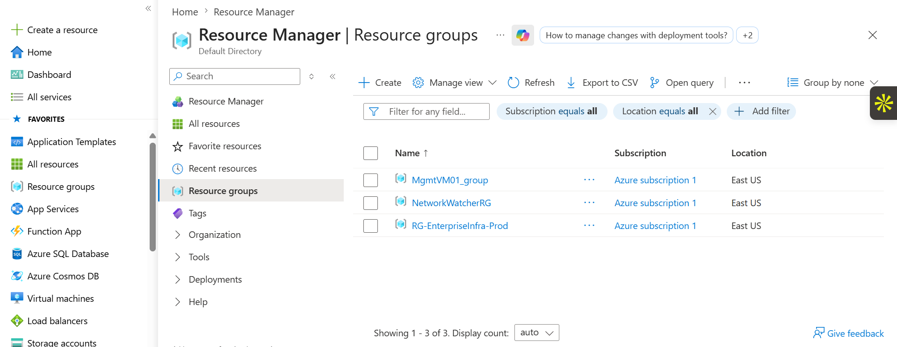
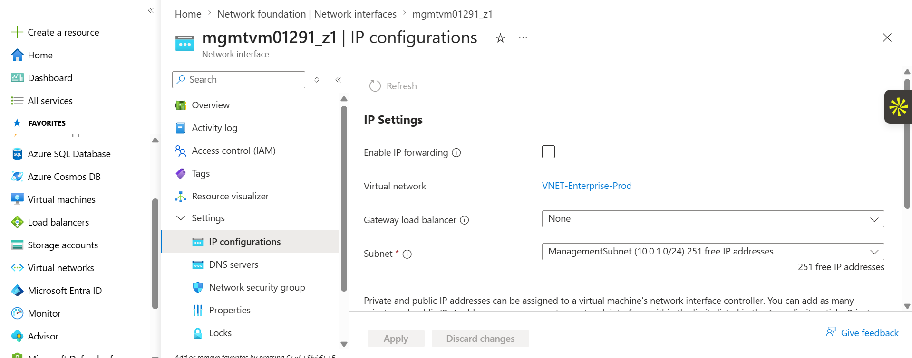
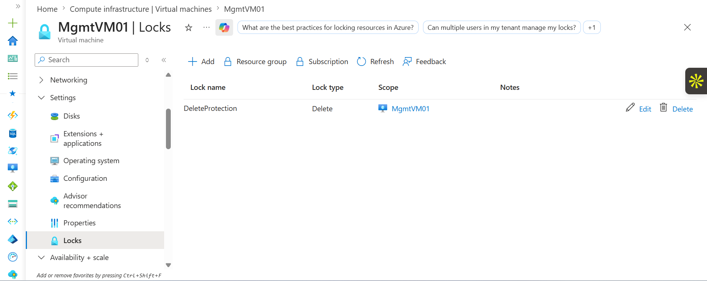
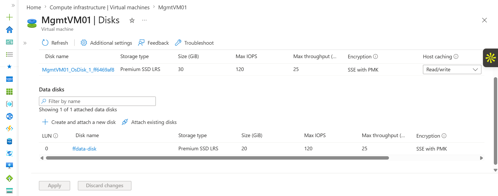
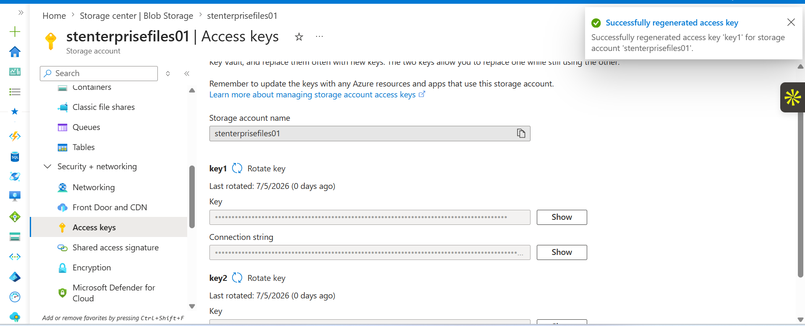
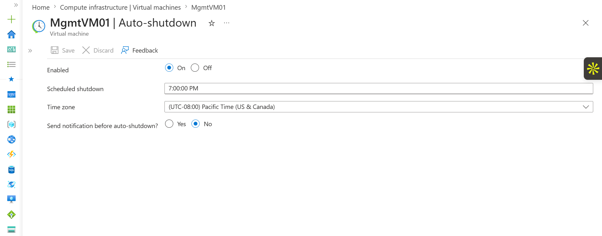

# Azure Networking and Storage Lab

## Overview
This project demonstrates hands-on implementation of Azure core services including networking, virtual machines, storage, and security.

---

## What I Built

### Networking
- Created subnets in a Virtual Network
- Configured Network Security Groups (NSG)
- Managed inbound security rules
- Updated IP configurations

### Virtual Machines
- Created and managed virtual machines
- Resized (vertical scaling)
- Configured automatic shutdown
- Applied tags and locks

### Storage
- Created storage containers
- Configured file shares
- Generated SAS tokens
- Managed access keys

---

## Screenshots

### Resource Group

### Virtual Network (VNet)

.png)

### Subnets

### IP Configuration

### Network Security Group (NSG)

### Virtual Machines

.png)

### Storage

### Auto Shutdown

---

## Skills Demonstrated
- Azure Virtual Networking (VNets, Subnets)
- Network Security Groups (NSG)
- Virtual Machine management
- Azure Storage services
- Security and governance
- Cost optimization

---

## Summary
This lab simulates a real-world Azure environment combining compute, networking, storage, and security best practices.
